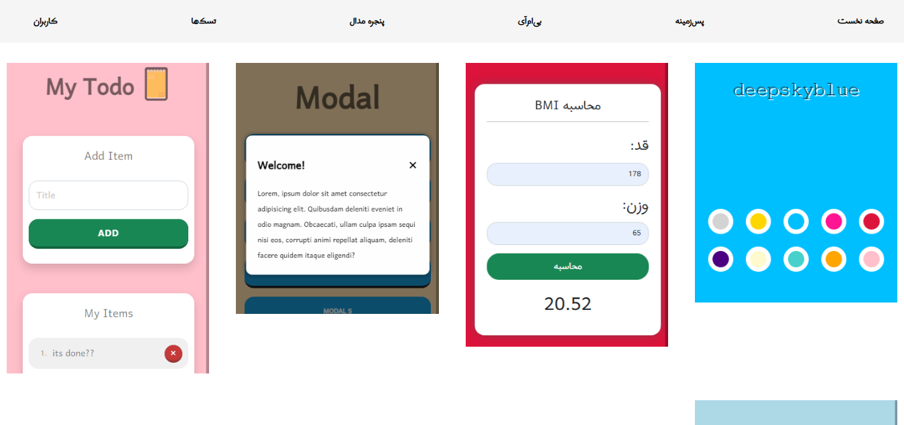

<!--
*** Thanks for checking out the Best-README-Template. If you have a suggestion
*** Don't forget to give the project a star!
-->

 

  

  <h3 align="center">JS-to-VUE</h3>

  

    این مخزن ۱۰ پروژه جاواسکریپتی ای که توسط سایت 'دیتی' توسعه داده شده بود که من به 'ویوو‌جی‌اس' تبدیلش کردم برای دوستانی که تازه ویوو رو شروع کردن.
     
    <a href="https://ditty-js-to-vue.netlify.app/">js-to-vue Demo</a>
    ·
    <a href="https://ditty.ir/courses/javascript-projects-for-beginners/introduction/X8gVn">Ditty project page</a>
  

  

  
   

